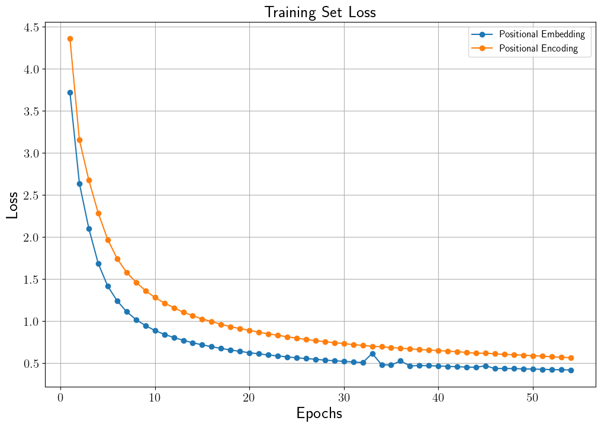
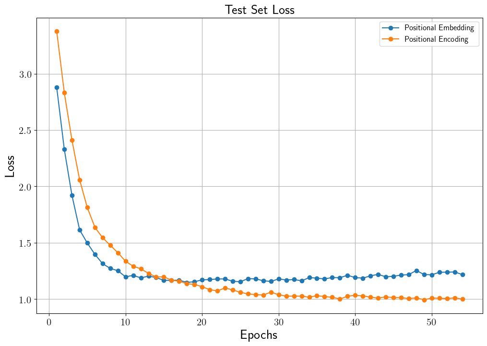
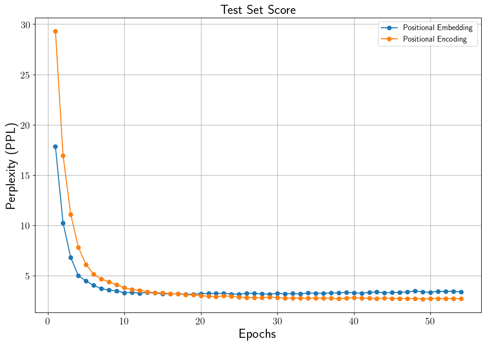
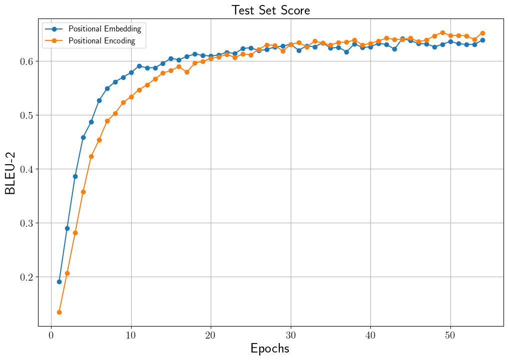
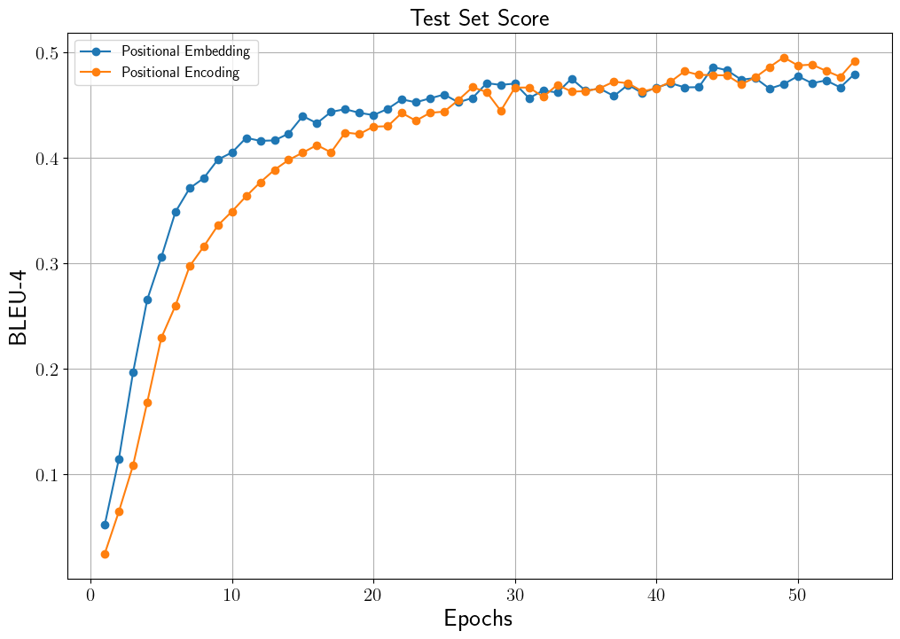
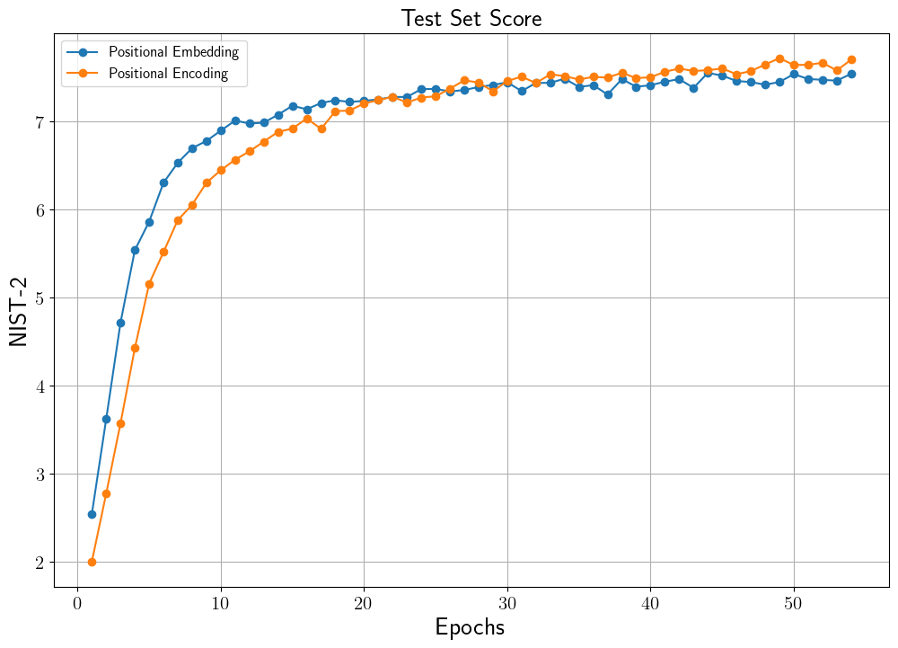

# Neural Machine Translator Transformer (Tatoeba Dataset)
## 설명
Tatoeba Project의 English-French 문장 쌍 데이터를 사용하여 [Transformer](https://arxiv.org/pdf/1706.03762.pdf) 기반의 기계 번역 모델을 제작합니다.
Transformer 기반 기계 번역 모델에 대한 설명은 [Transformer를 이용한 기계 번역](https://ljm565.github.io/contents/transformer2.html)을 참고하시기 바랍니다.
또한 본 모델은 vanilla transformer에서 사용하는 positional encoding 뿐만 아니라, positional embedding을 선택할 수 있습니다.
그리고 이렇게 임베딩 방법을 달리한 두 모델의 결과를 비교합니다.
<br><br>그리고 transformer의 성능을 GRU 기계 번역 모델과 비교하기 위해 이전에 [GRU 기반 기계 번역 프로젝트](https://github.com/ljm565/neural-machine-translator-GRU)와 같은 데이터를 사용하였으며, GRU 프로젝트와 토크나이저, 전처리 기법 등 모든 조건을 똑같이 하여 실험하였습니다.
GRU 기반의 기계 번역 모델 GitHub 프로젝트는 [neural-machine-translator-GRU](https://github.com/ljm565/neural-machine-translator-GRU)를 참고하시면 됩니다.
그리고 이 프로젝트에 대한 설명은 [Sequence-to-Sequence (Seq2Seq) 모델과 Attention](https://ljm565.github.io/contents/RNN2.html)을 참고하시면 됩니다.
<br><br><br>

## 모델 종류
* ### Transformer
    English-French 기계 번역 모델 제작을 위해 transformer를 학습합니다.
<br><br><br>


## 토크나이저 종류
* ### Word Tokenizer
    [GRU 기반 기계 번역 프로젝트](https://github.com/ljm565/neural-machine-translator-GRU)와 성능을 비교하기 위해 같은 토크나이저 사용합니다.
<br><br><br>

## 사용 데이터
* 실험으로 사용하는 데이터는 [Tatoeba Project](https://www.manythings.org/anki/)의 sentence pair 데이터 중, English-French 데이터셋입니다.
<br><br><br>


## 사용 방법
* ### 학습 방법
    학습을 시작하기 위한 argument는 4가지가 있습니다.<br>
    * [-d --device] {cpu, gpu}, **필수**: 학습을 cpu, gpu로 할건지 정하는 인자입니다.
    * [-m --mode] {train, test, inference}, **필수**: 학습을 시작하려면 train, 학습된 모델을 가지고 있어서 loss, BLEU 등의 결과를 보고싶은 경우에는 test로 설정해야합니다. 번역기를 테스트 해보고싶다면 inference로 설정해야합니다. test, inference 모드를 사용할 경우, [-n, --name] 인자가 **필수**입니다.
    * [-c --cont] {1}, **선택**: 학습이 중간에 종료가 된 경우 다시 저장된 모델의 체크포인트 부분부터 학습을 시작할 수 있습니다. 이 인자를 사용할 경우 -m train 이어야 합니다. 
    * [-n --name] {name}, **선택**: 이 인자는 -c 1 혹은 -m {test, inference} 경우 사용합니다.
    중간에 다시 불러서 학습을 할 경우 모델의 이름을 입력하고, test, inference를 할 경우에도 실험할 모델의 이름을 입력해주어야 합니다(최초 학습시 config.json에서 정한 모델의 이름의 폴더가 형성되고 그 폴더 내부에 모델 및 모델 파라미터가 json 파일로 형성 됩니다).<br><br>

    터미널 명령어 예시<br>
    * 최초 학습 시
        ```
        python3 main.py -d cpu -m train
        ```
    * 중간에 중단 된 모델 이어서 학습 시
        <br>주의사항: config.json을 수정해야하는 일이 발생 한다면 base_path/config.json이 아닌, base_path/model/{model_name}/{model_name}.json 파일을 수정해야 합니다.
        ```
        python3 main.py -d gpu -m train -c 1 -n {model_name}
        ```
    * 최종 학습 된 모델의 test set에 대한 loss, BLEU 등의 결과 등을 확인할 시
        <br>주의사항: config.json을 수정해야하는 일이 발생 한다면 base_path/config.json이 아닌, base_path/model/{model_name}/{model_name}.json 파일을 수정해야 수정사항이 반영됩니다.
        ```
        python3 main.py -d cpu -m test -n {model_name}
        ```
    * 최종 학습 된 모델의 test set에 대한 번역 모델을 테스트할 시
        <br>주의사항: config.json을 수정해야하는 일이 발생 한다면 base_path/config.json이 아닌, base_path/model/{model_name}/{model_name}.json 파일을 수정해야 수정사항이 반영됩니다.
        ```
        python3 main.py -d cpu -m inference -n {model_name}
        ```
    <br><br>

* ### 모델 학습 조건 설정 (config.json)
    * **주의사항: 최초 학습 시 config.json이 사용되며, 이미 한 번 학습을 한 모델에 대하여 parameter를 바꾸고싶다면 base_path/model/{model_name}/{model_name}.json 파일을 수정해야 합니다.**
    * base_path: 학습 관련 파일이 저장될 위치.
    * model_name: 학습 모델이 저장될 파일 이름 설정. 모델은 base_path/model/{model_name}/{model_name}.pt 로 저장.
    * loss_data_name: 학습 시 발생한 loss data를 저장하기 위한 이름 설정. base_path/loss/{loss_data_name}.pkl 파일로 저장. 내부에 중단된 학습을 다시 시작할 때, 학습 과정에 발생한 loss 데이터를 그릴 때 등 필요한 데이터를 dictionary 형태로 저장.
    * vocab_size: 최대 vocab size 설정.
    * max_len: 토큰화 된 번역 source, target 데이터의 최대 길이.
    * hidden_dim: Transformer 모델의 hidden dimension.
    * enc_num_layers: Transformer encoder의 레이어 수.
    * dec_num_layers: Transformer decoder의 레이어 수.
    * num_head: Transformer attention head 수.
    * bias: {0, 1} 중 선택. 1이면 모델이 bias를 사용.
    * dropout: 모델의 dropout 비율.
    * layernorm_eps: Layer normalization epsilon 값.
    * pos_encoding: {0, 1} 중 선택. 1이면 positional encoding, 0이면 positional embedding 사용.
    * batch_size: batch size 지정.
    * epochs: 학습 epoch 설정.
    * lr: learning rate 지정.
    * early_stop_criterion: Test set의 최소 loss를 내어준 학습 epoch 대비, 설정된 숫자만큼 epoch이 지나도 나아지지 않을 경우 학습 조기 종료.
    * result_num: 모델 테스트 시, 결과를 보여주는 sample 개수.
    <br><br><br>


## 결과
* ### Transformer Positional 임베딩 방법에 따른 모델별 결과
    아래 loss, score의 결과는 inference의 결과가 아닌 teacher forcing으로 확인한 결과입니다.
    그리고 아래 표기된 결과는 test set에서 가장 높은 BLEU-4를 달성한 모델의 점수입니다.
    따라서 그래프에서 보이는 학습 중 best score와 차이가 있을 수 있습니다.
    마지막으로 inference 방식으로 계산된 loss 및 score를 보고싶다면 inference mode로 실행 시 자동 계산 되므로 확인할 수 있습니다.
    <br><br>그리고 transformer와 비교하는 GRU 모델은 [neural-machine-translator-GRU](https://github.com/ljm565/neural-machine-translator-GRU) 프로젝트의 "Model with Attention" 모델입니다.
    이 모델의 학습 중 가장 높은 BLEU-4를 달성한 모델(9 epoch)의 결과를 표기하였습니다.
    * Training Set Loss History<br>
        <br><br>

    * Test Set Loss History<br>
        <br>
        * Model with Positional Embedding: 1.1979
        * Model with Positional Encoding: 0.9946<br><br>

    * Test Set Perplexity (PPL) History<br>
        <br>
        * Model with Positional Embedding: 3.3132
        * Model with Positional Encoding: 2.7038<br><br>

    * BLEU-2 Score History<br>
        <br>
        * Model with Positional Embedding: 0.6411
        * Model with Positional Encoding: 0.6529
        * GRU Model with Bahdanau Attention: 0.5818<br><br>

    * BLEU-4 Score History<br>
        <br>
        * Model with Positional Embedding: 0.4857
        * Model with Positional Encoding: 0.4949
        * GRU Model with Bahdanau Attention: 0.4071<br><br>

    * NIST-2 Score History<br>
        <br>
        * Model with Positional Embedding: 7.5464
        * Model with Positional Encoding: 7.7141
        * GRU Model with Bahdanau Attention: 6.9003<br><br>

    * NIST-4 Score History<br>
        <br>
        * Model with Positional Embedding: 7.9196
        * Model with Positional Encoding: 8.0932
        * GRU Model with Bahdanau Attention: 7.2171<br><br>


    * 기계 번역 결과 샘플<br>
        Inference의 결과가 아닌 teacher forcing으로 확인한 결과입니다.
        Inference 방식으로 계산된 번역 결과를 확인 하고싶다면 inference mode로 실행 시 확인할 수 있습니다.
        그리고 inference를 할 때 위의 번역 결과 샘플을 내어준 후, 실제 번역기 테스트가 가능합니다.
        * Model with Positional Embedding
            ```
            # Sample 1
            src : i'm sure of this .
            gt  : j'en suis sur .
            pred: j'en suis sure .


            # Sample 2
            src : we have something very important that we need to discuss .
            gt  : il nous faut discuter de quelque chose de tres important .
            pred: nous nous faut des de quelque chose de tres important .


            # Sample 3
            src : why are they so upset ?
            gt  : pourquoi sont-ils si [UNK] ?
            pred: pourquoi sont-elles si contrarie ?

            ```


        * Model with Positional Encoding
            ```
            # Sample 1
            src : that isn't enough .
            gt  : ce n'est pas assez .
            pred: ce n'est pas suffisant .


            # Sample 2
            src : i don't think that's the point .
            gt  : je ne pense que cela soit ce dont il s'agit .
            pred: je ne pense pas ce se pas que il s'agit .


            # Sample 3
            src : everyone laughed at him .
            gt  : tout le monde a ri de lui .
            pred: tout le monde l'a ri de lui .
            ```
            <br><br>


<br><br><br>
