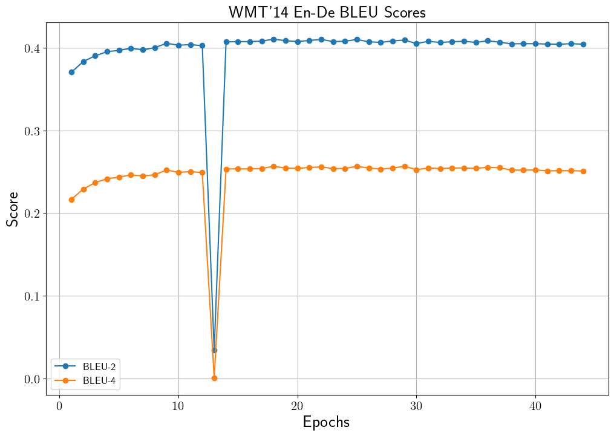
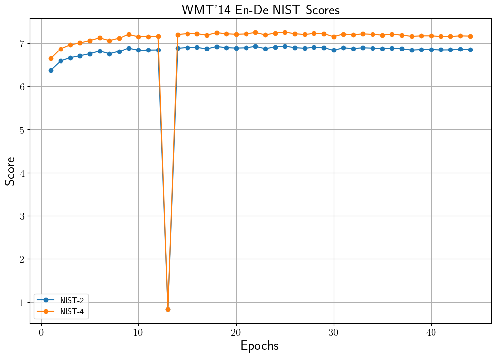
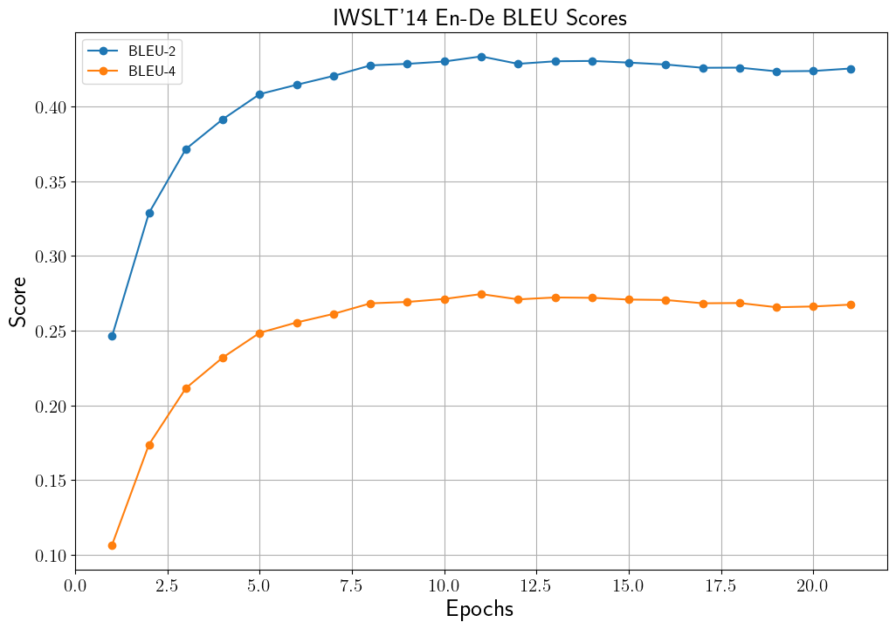
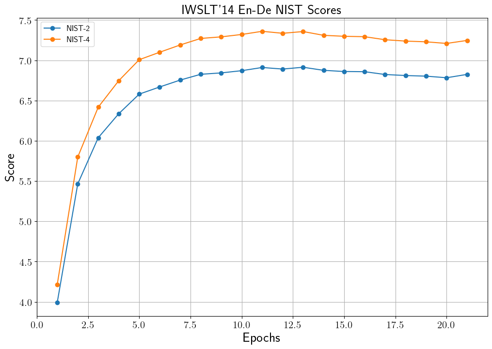

# Neural Machine Translator Transformer (WMT'14, IWSLT'14 En-De)
## 설명
WMT'14와 IWSLT'14의 English-Deutschland (영어-독일어) 문장 쌍 데이터를 사용하여 [Transformer](https://arxiv.org/pdf/1706.03762.pdf) 기반의 기계 번역 모델을 제작합니다.
Transformer 기반 기계 번역 모델에 대한 설명은 [Transformer를 이용한 WMT'14, IWSLT'14 (En-De) 기계 번역](https://ljm565.github.io/contents/transformer2.html)을 참고하시기 바랍니다.
또한 본 모델은 vanilla transformer에서 사용하는 positional encoding 뿐만 아니라, positional embedding을 선택할 수 있습니다.
마지막으로 최종 학습된 모델을 바탕으로 기계 번역 benchmark score를 계산할 때 많이 사용되는 [multi_bleu.perl](https://github.com/moses-smt/mosesdecoder/blob/master/scripts/generic/multi-bleu.perl)을 이용하여 점수를 계산할 수도 있습니다.
<br><br><br>

## 모델 종류
* ### Transformer
    English-Deutschland 기계 번역 모델 제작을 위해 transformer를 학습합니다.
<br><br><br>


## 토크나이저 종류
* ### Wordpiece Tokenizer
    Likelihood 기반으로 BPE를 수행한 subword 토크나이저를 사용합니다.
    또한 영어, 독일어 데이터를 통합하여 shared vocab을 구성합니다.

    * IWSLT'14: IWSLT'14 데이터를 사용할 경우에는 wordpiece 토크나이저의 vocab 파일을 모델 학습 전에 아래 명령어를 이용하여 먼저 제작해야합니다. 제작할 vocab의 크기는 src/tokenizer/make_vocab.sh에서 수정할 수 있습니다(Defaut: 10,000).
    
        ```
        cd src/tokenizer
        bash ./make_vocab.sh
        ```
<br><br>

## BLEU Score 계산 방법
* ### [NLTK](https://www.nltk.org/_modules/nltk/translate/bleu_score.html)
    기본적으로 학습을 진행할 때 모델 저장의 지표로 사용되는 BLEU-4 계산은 NLTK를 사용합니다.

* ### [multi_bleu.perl](https://github.com/moses-smt/mosesdecoder/blob/master/scripts/generic/multi-bleu.perl)
    학습이 완료되어 validation set에 대해 가장 높은 점수를 내어준 모델을 저장한 후, test set에 대하여 아래의 명령어로 multi_bleu.perl을 이용하여 BLEU score를 계산할 수 있습니다.
    ```
    # device: cpu or gpu
    python3 src/main.py -d {device} -m multi_bleu_perl -n {model_name}
    ```
    
    만약 위의 명령어가 permission denied error가 나타난다면 아래의 명령어를 추가로 실행해주어야합니다.
    ```
    # device: cpu or gpu
    chmode +x etc/multi_bleu.perl
    python3 src/main.py -d {device} -m multi_bleu_perl -n {model_name}
    ```
<br><br>

## 사용 데이터
여기서 나와있는 data_sample은 전체 데이터가 아닌 일부 sample 데이터입니다. 전체 데이터는 아래 링크에서 받을 수 있습니다.
만약 코드가 돌아가는지 확인하기 위해서는 아래 명령어를 먼저 실행해서 데이터 폴더 이름을 변경해야합니다.
```
mv data_sample data
```
* ### WMT'14 (En-De)
    [Stanford WMT'14](https://nlp.stanford.edu/projects/nmt/)의 데이터를 사용.

* ### IWSLT'14 (En-De)
    [fairseq](https://github.com/facebookresearch/fairseq)의 데이터를 사용.
<br><br><br>


## 사용 방법
* ### 학습 방법
    **코드 테스트를 해보기 전, 먼저 데이터 폴더 이름을 위의 '사용 데이터' 부분에 설명한 것 처럼 바꿔줘야 합니다.**
    바꿔준 후, 학습을 시작하기 위한 argument는 4가지가 있습니다.<br>
    * [-d --device] {cpu, gpu}, **필수**: 학습을 cpu, gpu로 할건지 정하는 인자입니다.
    * [-m --mode] {train, inference, multi_bleu_perl}, **필수**: 학습을 시작하려면 train, 학습된 모델을 가지고 있어서 BLEU 등의 결과를 보고싶은 경우에는 inference로 설정해야합니다. multi_bleu_perl 사용 방법은 위의 "BLEU Score 계산 방법" 참고하시기 바랍니다.
    inference 모드를 사용할 경우, [-n, --name] 인자가 **필수**입니다.
    * [-c --cont] {1}, **선택**: 학습이 중간에 종료가 된 경우 다시 저장된 모델의 체크포인트 부분부터 학습을 시작할 수 있습니다. 이 인자를 사용할 경우 -m train 이어야 합니다. 
    * [-n --name] {name}, **선택**: 이 인자는 -c 1 혹은 -m {inference, multi_bleu_perl} 경우 사용합니다.
    중간에 다시 불러서 학습을 할 경우 모델의 이름을 입력하고, inference를 할 경우에도 실험할 모델의 이름을 입력해주어야 합니다(최초 학습시 config.json에서 정한 모델의 이름의 폴더가 형성되고 그 폴더 내부에 모델 및 모델 파라미터가 json 파일로 형성 됩니다).<br><br>

    터미널 명령어 예시<br>
    * 최초 학습 시
        ```
        python3 src/main.py -d cpu -m train
        ```
    * 중간에 중단 된 모델 이어서 학습 시
        <br>주의사항: config.json을 수정해야하는 일이 발생 한다면 base_path/config.json이 아닌, base_path/model/{model_name}/{model_name}.json 파일을 수정해야 합니다.
        ```
        python3 src/main.py -d gpu -m train -c 1 -n {model_name}
        ```
    * 최종 학습 된 모델의 test set에 대한 BLEU 등의 결과 등을 확인할 시 (multi_bleu.perl은 "BLEU Score 계산 방법" 참고)
        <br>주의사항: config.json을 수정해야하는 일이 발생 한다면 base_path/config.json이 아닌, base_path/model/{model_name}/{model_name}.json 파일을 수정해야 수정사항이 반영됩니다.
        ```
        python3 src/main.py -d cpu -m inference -n {model_name}
        ```
    <br><br>

* ### 모델 학습 조건 설정 (config.json)
    **주의사항: 최초 학습 시 config.json이 사용되며, 이미 한 번 학습을 한 모델에 대하여 parameter를 바꾸고싶다면 base_path/model/{model_name}/{model_name}.json 파일을 수정해야 합니다.**
    * data_type: {"iwslt14-ende", "wmt14-ende"} 중 선택. 전자와 후자는 각각 IWSLT'14, WMT'14 데이터를 의미.
    * ende: {0, 1} 중 선택. 전자는 de-en 번역, 후자는 en-de 번역을 의미.
    * base_path: 학습 관련 파일이 저장될 위치.
    * model_name: 학습 모델이 저장될 파일 이름 설정. 모델은 base_path/model/{model_name}/{model_name}.pt 로 저장.
    * loss_data_name: 학습 시 발생한 loss data를 저장하기 위한 이름 설정. base_path/loss/{loss_data_name}.pkl 파일로 저장. 내부에 중단된 학습을 다시 시작할 때, 학습 과정에 발생한 loss 데이터를 그릴 때 등 필요한 데이터를 dictionary 형태로 저장.
    * vocab_size: IWSLT'14 학습 시 제작된 vocab 파일들 중 원하는 vocab size 선택. 만약 vocab_size를 10,000으로 설정 했을 시, data/iwslt-en-de/tokenizer 폴더 내에 vocab_10000이라는 이름의 학습된 폴더 있어야함.
    * max_len: 토큰화 된 번역 source, target 데이터의 최대 길이.
    * hidden_dim: Transformer 모델의 hidden dimension.
    * ffn_dim: Transformer 모델의 feed forward network의 hidden dimension.
    * enc_num_layers: Transformer encoder의 레이어 수.
    * dec_num_layers: Transformer decoder의 레이어 수.
    * num_head: Transformer attention head 수.
    * bias: {0, 1} 중 선택. 1이면 모델이 bias를 사용.
    * dropout: 모델의 dropout 비율.
    * layernorm_eps: Layer normalization epsilon 값.
    * pos_encoding: {0, 1} 중 선택. 1이면 positional encoding, 0이면 positional embedding 사용.
    * batch_size: batch size 지정.
    * epochs: 학습 epoch 설정.
    * lr: learning rate 지정.
    * early_stop_criterion: Test set의 최소 loss를 내어준 학습 epoch 대비, 설정된 숫자만큼 epoch이 지나도 나아지지 않을 경우 학습 조기 종료.
    * result_num: 모델 테스트 시, 결과를 보여주는 sample 개수.
    <br><br><br>


## 결과
* ### 학습 데이터별 결과
    아래 score의 결과는 validation set의 inference로 확인한 결과입니다.
    그리고 아래 표기된 결과는 validation set의 가장 높은 BLEU-4를 달성했을 때 모델의 test set BLEU-4 입니다.
    따라서 그래프에서 보이는 학습 중 best score와 차이가 있을 수 있습니다.
    BLEU-4 score는 각각 NLTk, multi_bleu.perl을 사용하여 계산한 결과입니다.
    
    * WMT'14 (En-De) Validation Set BLEU History<br>
        <br>
        * Test set BLEU-4: 0.2803 (NLTK)
        * Test set BLEU-4: 0.2803 (multi_bleu.perl)<br><br>

    * WMT'14 (En-De) Validation Set NIST History<br>
        <br><br>

    * IWSLT'14 (En-De) Validation Set BLEU History<br>
        <br>
        * Test set BLEU-4: 0.2579 (NLTK)
        * Test set BLEU-4: 0.2580 (multi_bleu.perl)<br><br>

    * IWSLT'14 (En-De) Validation Set NIST History<br>
        <br><br>


    * 기계 번역 결과 샘플<br>
        Inference로 확인한 결과입니다.
        * WMT'14 학습 모델
            ```
            # Sample 1
            gt  : „ erwachsene sollten in der lage sein , eigene entscheidungen uber ihr rechtliche ##s geschlecht zu treffen “ , erklarte sie .
            pred: " erwachsene sollten in der lage sein , ihre eigenen entscheidungen uber das legal ##e geschlecht zu treffen " , sagte sie .


            # Sample 2
            gt  : insgesamt seien vier verkehrs ##schauen durchgefuhrt worden , auch ein kreis ##verkehr wurde ange ##dacht , allerdings wegen der enge in dem kreuzung ##s ##bereich sulz ##bach ##weg / kirchimportant .
            pred: insgesamt wurden vier sicherheits ##kontrollen im straßenverkehr durchgefuhrt , und auch ein kreis ##verkehr wurde berucksichtigt , jedoch wurde dieser gedanke aufgrund der engen linien abgelehnt .


            # Sample 3
            gt  : austral ##ische flug ##pass ##agi ##e ##re mussen auch weiterhin tablets und smartphones bei start und landung abschalten , trotz bemuhungen in den usa , die regelungen fur derartige gerate
            pred: flug ##gaste austral ##ischer fluggesellschaft mussen trotz der bemuhungen in den usa , die bestimmungen uber die flug ##pass ##agi ##e ##re zu locker ##n , ihre flug ##table ##tten

            ```


        * IWSLT'14 학습 모델
            ```
            # Sample 1
            gt  : ein sehr konk ##rete ##r wunsch , dass wir diese technologie erfinden .
            pred: es ist ein sehr konk ##ret wunsch , dass wir diese technologie erfinden .


            # Sample 2
            gt  : wir durch ##laufen initi ##ations ##ri ##t ##ual ##e .
            pred: wir durch ##laufen den initi ##ations ##ri ##k .


            # Sample 3
            gt  : vac ##la ##v have ##l , der große ts ##che ##ch ##ische politiker , hat einmal gesagt :
            pred: v ##la ##v haben ##l den großen c ##ze ##ch - anfü ##hrer , darüber gesprochen .
            ```
            <br><br>


<br><br><br>
