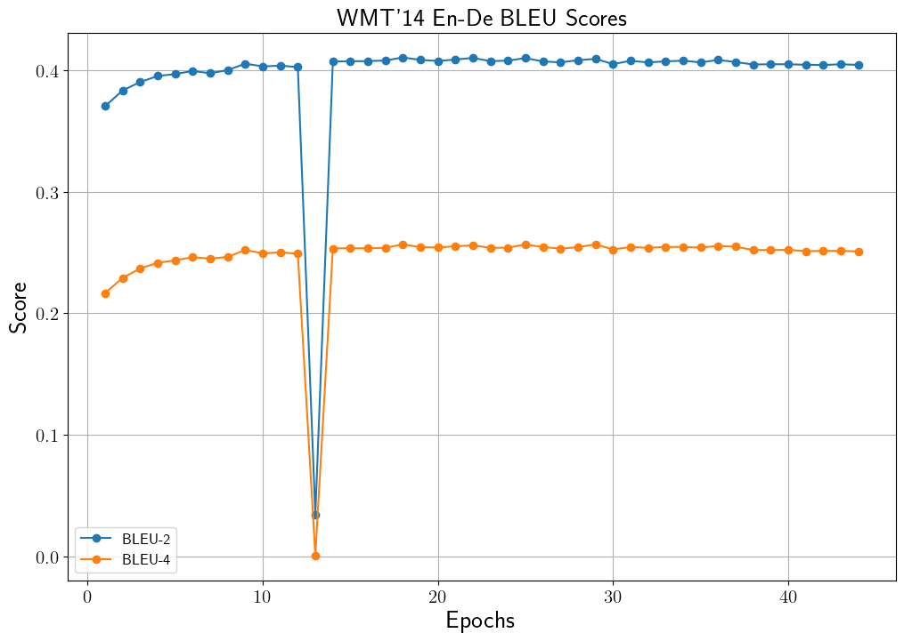
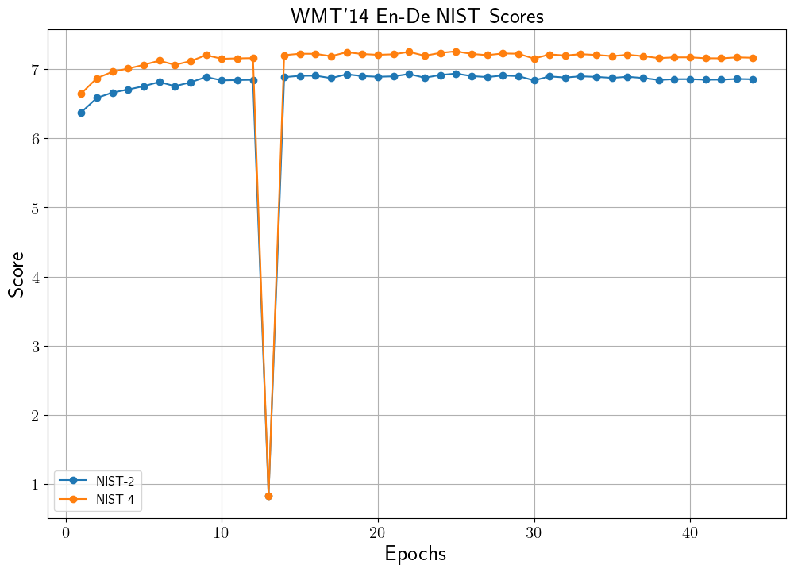
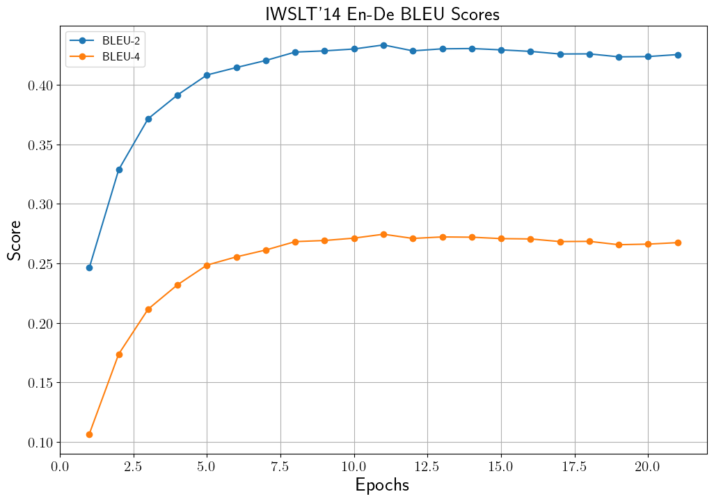
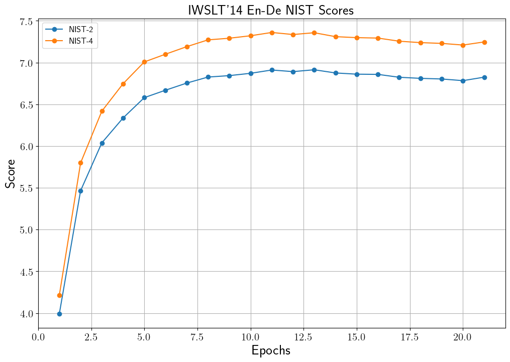

# Neural Machine Translator Transformer (WMT'14, IWSLT'14 En-De)

## Introduction
WMT'14와 IWSLT'14의 English-Deutschland (영어-독일어) 문장 쌍 데이터를 사용하여 [Transformer](https://arxiv.org/pdf/1706.03762.pdf) 기반의 기계 번역 모델을 제작합니다.
Transformer 기반 기계 번역 모델에 대한 설명은 [Transformer를 이용한 WMT'14, IWSLT'14 (En-De) 기계 번역](https://ljm565.github.io/contents/transformer2.html)을 참고하시기 바랍니다.
또한 본 모델은 vanilla transformer에서 사용하는 positional encoding 뿐만 아니라, positional embedding을 선택할 수 있습니다.
마지막으로 최종 학습된 모델을 바탕으로 기계 번역 benchmark score를 계산할 때 많이 사용되는 [multi_bleu.perl](https://github.com/moses-smt/mosesdecoder/blob/master/scripts/generic/multi-bleu.perl)을 이용하여 점수를 계산할 수도 있습니다.
<br><br><br>

## Supported Models
### Transformer
* Transformer
<br><br><br>

## Supported Tokenizer
### Wordpiece Tokenizer
Likelihood 기반으로 BPE를 수행한 subword 토크나이저를 사용합니다.
또한 영어, 독일어 데이터를 통합하여 shared vocab을 구성합니다.

* IWSLT'14: IWSLT'14를 학습할 때는 자동으로 tokenizer가 [make_vocab.sh](src/tools/tokenizers/build/make_vocab.sh) 파일을 통해 학습 됩니다(Default: 10,000). 사용자는 `config/config.yaml`에서 vocabulary 크기를 설정할 수 있습니다.
* WMT'14: Hugging Face의 pre-trained 토크나이저를 자동으로 불러서 사용합니다.
<br><br>

## Base Dataset
여기서 나와있는 data_sample은 전체 데이터가 아닌 일부 sample 데이터입니다. 전체 데이터는 아래 링크에서 받을 수 있습니다.
만약 코드가 돌아가는지 확인하기 위해서는 아래 명령어를 먼저 실행해서 데이터 폴더 이름을 변경해야합니다.
```bash
mv data_sample data
```
* WMT'14 (En-De): [Stanford WMT'14](https://nlp.stanford.edu/projects/nmt/)
* IWSLT'14 (En-De): [fairseq](https://github.com/facebookresearch/fairseq)
* Custom: Train/validation/test 데이터 경로를 `config/config.yaml`에 설정해야하며, custom tokenizer, dataloader를 구성하여 `src/trainer/build.py`에 코드를 구현해야합니다.
<br><br><br>

## Supported Devices
* CPU, GPU, multi-GPU (DDP), MPS (for Mac and torch>=1.12.0)
<br><br><br>

## Quick Start
```bash
python3 src/run/train.py --config config/config.yaml --mode train
```
<br><br>


## Project Tree
본 레포지토리는 아래와 같은 구조로 구성됩니다.
```
├── configs                           <- Config 파일들을 저장하는 폴더
│   └── *.yaml
│
├── etc                               
│   └── multi_bleu.perl               <- BLEU score를 계산하기 위한 perl 스크립트
│
└── src      
    ├── models
    |   ├── embeddings.py             <- Transformer embedding 레이어
    |   ├── modules.py                <- Attention, FFN, etc. 레이어
    |   └── transformer.py            <- Whole encoder, decoder and transformer 모델
    |
    ├── run                   
    |   ├── multi_bleu_perl.py        <- multi_bleu.perl을 이용해서 BLEU score를 계산하는 코드
    |   ├── train.py                  <- 학습 실행 파일
    |   └── validation.py             <- 학습된 모델 평가 실행 파일
    |
    ├── tools                   
    |   ├── tokenizers
    |   |   ├── build                 <- IWSLT 학습 시 custom tokenizer 학습을 위한 코드 폴더
    |   |   |   ├── make_vocab.sh
    |   |   |   └── vocab_trainer.py
    |   |   └── tokenizer.py          <- Tokenizer classes of IWSLT and WMT
    |   |
    |   ├── early_stopper.py          <- Early stopper class 파일
    |   ├── evaluator.py              <- Metric evaluator class 파일
    |   ├── model_manager.py          
    |   └── training_logger.py        <- Training logger class 파일
    |
    ├── trainer                 
    |   ├── build.py                  <- Dataset, dataloader 등을 정의하는 파일
    |   └── trainer.py                <- 학습, 평가 등을 수행하는 class 파일
    |
    └── uitls                   
        ├── __init__.py               <- Logger, 버전 등을 초기화 하는 파일
        ├── data_utils.py             <- Dataloader 정의 파일r
        ├── filesys_utils.py       
        ├── func_utils.py       
        └── training_utils.py     
```
<br><br>

## Tutorials & Documentations
Transformer 기계 번역 모델을 학습하기 위해서 다음 과정을 따라주시기 바랍니다.
1. [Getting Started](./1_getting_started_ko.md)
2. [Data Preparation](./2_data_preparation_ko.md)
3. [Training](./3_trainig_ko.md)
4. ETC
   * [Evaluation](./4_model_evaluation_ko.md)
   * [Calculate BLEU via `perl` Script](./5_cal_multi_bleu_perl_ko.md)
<br><br><br>

## Training Results
### Each Result of Transformer Neural Machine Translator
아래 score의 결과는 validation set의 inference로 확인한 결과입니다.
그리고 아래 표기된 결과는 validation set의 가장 높은 BLEU-4를 달성했을 때 모델의 test set BLEU-4 입니다.
따라서 그래프에서 보이는 학습 중 best score와 차이가 있을 수 있습니다.
BLEU-4 score는 각각 NLTk, `multi_bleu.perl`을 사용하여 계산한 결과입니다.
    
* WMT'14 (En-De) Validation Set BLEU History<br>
    <br>
    * Test set BLEU-4: 0.2803 (NLTK)
    * Test set BLEU-4: 0.2803 (multi_bleu.perl)<br><br>

* WMT'14 (En-De) Validation Set NIST History<br>
    <br><br>

* IWSLT'14 (En-De) Validation Set BLEU History<br>
    <br>
    * Test set BLEU-4: 0.2579 (NLTK)
    * Test set BLEU-4: 0.2580 (multi_bleu.perl)<br><br>

* IWSLT'14 (En-De) Validation Set NIST History<br>
    <br><br>


### Translated Samples of Each Transformer Model
* WMT'14 Trained Model
    ```
    # Sample 1
    gt  : „ erwachsene sollten in der lage sein , eigene entscheidungen uber ihr rechtliche ##s geschlecht zu treffen “ , erklarte sie .
    pred: " erwachsene sollten in der lage sein , ihre eigenen entscheidungen uber das legal ##e geschlecht zu treffen " , sagte sie .


    # Sample 2
    gt  : insgesamt seien vier verkehrs ##schauen durchgefuhrt worden , auch ein kreis ##verkehr wurde ange ##dacht , allerdings wegen der enge in dem kreuzung ##s ##bereich sulz ##bach ##weg / kirchimportant .
    pred: insgesamt wurden vier sicherheits ##kontrollen im straßenverkehr durchgefuhrt , und auch ein kreis ##verkehr wurde berucksichtigt , jedoch wurde dieser gedanke aufgrund der engen linien abgelehnt .


    # Sample 3
    gt  : austral ##ische flug ##pass ##agi ##e ##re mussen auch weiterhin tablets und smartphones bei start und landung abschalten , trotz bemuhungen in den usa , die regelungen fur derartige gerate
    pred: flug ##gaste austral ##ischer fluggesellschaft mussen trotz der bemuhungen in den usa , die bestimmungen uber die flug ##pass ##agi ##e ##re zu locker ##n , ihre flug ##table ##tten

    ```


* IWSLT'14 Trained Model
    ```
    # Sample 1
    gt  : ein sehr konk ##rete ##r wunsch , dass wir diese technologie erfinden .
    pred: es ist ein sehr konk ##ret wunsch , dass wir diese technologie erfinden .


    # Sample 2
    gt  : wir durch ##laufen initi ##ations ##ri ##t ##ual ##e .
    pred: wir durch ##laufen den initi ##ations ##ri ##k .


    # Sample 3
    gt  : vac ##la ##v have ##l , der große ts ##che ##ch ##ische politiker , hat einmal gesagt :
    pred: v ##la ##v haben ##l den großen c ##ze ##ch - anfü ##hrer , darüber gesprochen .
    ```


<br><br><br>
